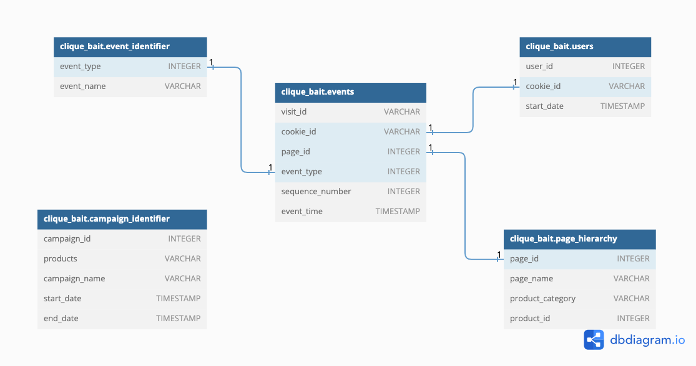

## Enterprise Relationship Diagram

Using the following DDL schema details to create an ERD for all the Clique Bait datasets.

[Click here to access the DB Diagram tool](https://dbdiagram.io) to create the ERD.  
Follow the given code to generate the ERD on the site mentioned above.

```sql
TABLE clique_bait.event_identifier {
  event_type INTEGER
  event_name VARCHAR
}

TABLE clique_bait.campaign_identifier {
  campaign_id INTEGER
  products VARCHAR
  campaign_name VARCHAR
  start_date TIMESTAMP
  end_date TIMESTAMP
}

TABLE clique_bait.page_hierarchy {
  page_id INTEGER
  page_name VARCHAR
  product_category VARCHAR
  product_id INTEGER
}

TABLE clique_bait.users {
  user_id INTEGER
  cookie_id VARCHAR
  start_date TIMESTAMP
}

TABLE clique_bait.events {
  visit_id VARCHAR
  cookie_id VARCHAR
  page_id INTEGER
  event_type INTEGER
  sequence_number INTEGER
  event_time TIMESTAMP
}

Ref: clique_bait.events.event_type > clique_bait.event_identifier.event_type
Ref: clique_bait.events.page_id > clique_bait.page_hierarchy.page_id
Ref: clique_bait.events.cookie_id > clique_bait.users.cookie_id
```


